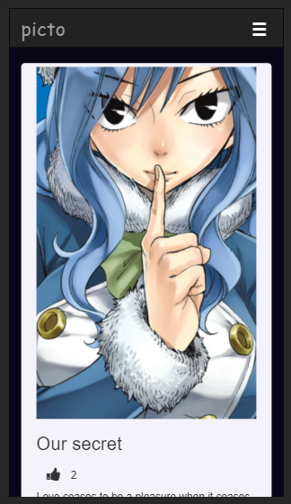
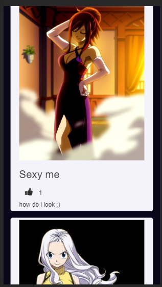
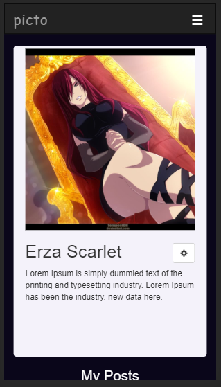
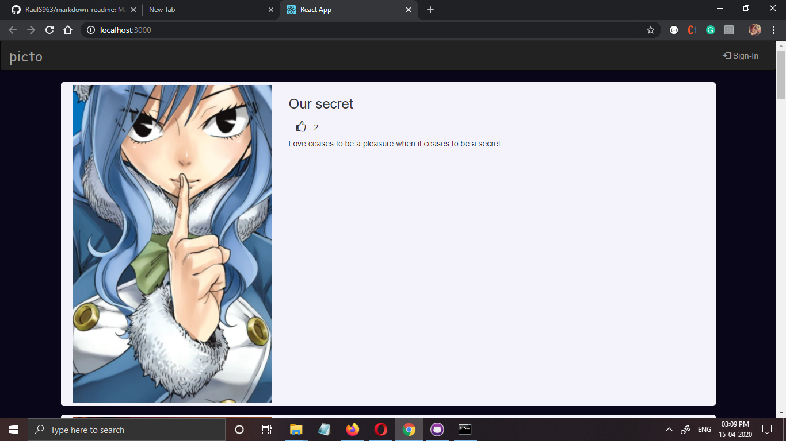
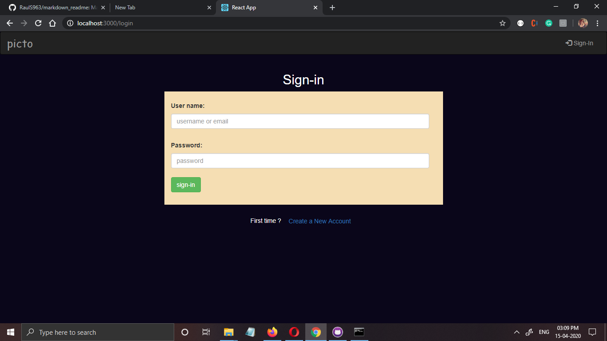

# Picto

# Contents
* [Introduction](#introduction)
* [Technologies Used](#technologies-used)
* [Dependencies](#dependencies)
* [Database Schema](#database-schema)
* [How to use](#how-to-use)
* [Screenshots](#screenshots)

# Introduction

Picto is a simple photo sharing app created using React JS and PHP. The authorized user can post pictures, like others post.
The main purpose of this project was to learn ```React JS``` and how it interacts with the backend technologies, therefore this app (in its current version) misses few features such as  commenting on post, deleting a post, forget password, etc. These missing features will be added in its new version.

**current version:** 1.0


# Technologies Used

**Front-end:** React JS, Bootstrap  
**Back-end:** PHP, MySQL


# Dependencies

* React JS runs on port no. 3000 and my PHP projrct runs on port no. 9090, thus to enable cross-origin data communication use a chrome extension called ```Allow CROS```.  
  [CROS chrome extension](https://chrome.google.com/webstore/detail/allow-cors-access-control/lhobafahddgcelffkeicbaginigeejlf?hl=en)
  <p></p>
 * **react-router-dom :** To install react router dom use
   ```
   >npm install react-router-dom
   ```
 * **js-cookie :** js-cookie is used to store cookies in browser. To install js cookie use
   ```
   >npm install js-cookie
   ```

# Database Schema

**DataBase name:** pictodb  
 ```
 pictodb
   |--users
   |--post_list
   |--like_post
 ```
<p></p>

**Table:  ```users```**

Column Name   | Type        | Default | Null | Extra  
--------------|-------------|---------|------|-------|  
id            | int         |         | _no_ | primary key, auto increment|  
username      | varchar(50) |         |_no_  |       |  
userpassword  | varchar(200)|         |_no_  |       |  
email_id      | varchar(140)|         |_no_  |       |  
is_active     | int         |   1     |_no_  |       |  
doj           |date         |         |_no_  |       |  
profile_pic   |mediumtext   |         |_no_  |       |  
caption       | varchar(140)|         | yes  |       |  


**Table:  ```post_list```**
Column Name   | Type        | Default | Null | Extra  
--------------|-------------|---------|------|-------|  
post_id       | int         |         | _no_ | primary key, auto increment|  
title         | varchar(80) |         |_no_  |       |  
user_id       | int         |         |_no_  | foreign key refs, id from users |  
post_date     | datetime    |         |_no_  |       |  
pic_src       | mediumtext  |   1     |_no_  |       |  
caption       | varchar(160)|         |_yes_ |       |  
likes         | int         |   0     |_no_  |       |  


**Table: ```like_list```**
Column Name   | Type        | Default | Null | Extra  
--------------|-------------|---------|------|-------|  
post_id       | int         |         | _no_ |       |  
posted_by     | int         |         |_no_  |       |  
liked_by      | int         |         |_no_  |       |


# How to Use

* Clone the projet and save it to your local desktop.
* Inside the project folder you can see various folders such as _back-end_, _front-end_, etc. Open the ```back-end (php)``` folder and copy-paste the folder ```picto``` to your ```www``` directory if you are using WAMP or to your ```htdocs``` directory if you are using XAMPP.
* Copy the contents of ```front-end``` folder and paste them in your react application. To create a react app you can use the command ```npx create-react-app your_app_name```.
* Create the Database and tables according the schema as mentioned above.
* Open command prompt in your react directory and start the react server by typing ```npm start```.


# Screenshots
  
 
